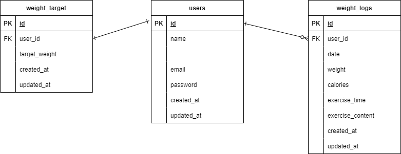

# Pigly  

## 環境構築  
### Dockerビルド  
1. git clone git@github.com:coachtech-material/laravel-docker-template.git  

 mv laravel-docker-template laravel-confirm-test3  

2. DockerDesktopアプリの立ち上げ  
3. docker-compose up -d --build  
### Laravel環境構築  
1. docker-compose exec php bash  
2. composer install  
3. .envに環境変数を追加  
    DB_HOST = mysql  
    DB_DATABASE=laravel_db  
    DB_USERNAME=laravel_user  
    DB_PASSWORD=laravel_pass  
4. アプリケーションキーの作成  
    php artisan key:generate  
5. マイグレーションの実行  
    php artisan migrate  
6. シーディングの実行  
    php artisan db:seed  
## 使用技術（実行環境）  
 - PHP7.4.9  
 - Laravel8.83.29  
 - MySQL8.0.26  
## ER図  

## URL
- 開発環境：http://localhost/  

- phpMyAdmin:http://localhost:8080/  

  ## クローン  
1. cd coachtech laravel  
2. git clone git@github.com:yuriko52-star/laravel-confirm-test3.git  
3. mv laravel-confirm-test3 test3   
4. cd test3   
5. git remote set-url origin git@github.com:yuriko52-star/test3.git    
6. git remote -v  
7. git add .  
8. git commit -m "コメント"  
9. git push origin main  
10. docker-compose up -d --build  
11. composer install  
12. cp .env.example .env  
13. .envに環境変数を追加(上記参照)  
14. php artisan key:generate  
15. php artisan migrate  
16. php artisan db:seed  
   
  
      
